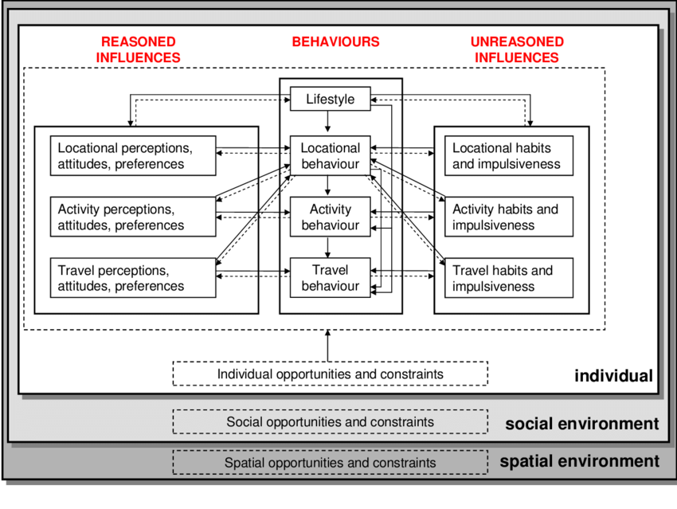

# Synthetic Travel Survey Data Generation

## Why Do We Travel?

When Johnathan Suburbia gets into his 2015 Honda LX Civic Sedan, one highly doubts the first thing John thinks is `"it is now time to use the A* search algorithm to obtain the optimal route to my work location"`. I would argue he's thinking of one of three things:

- I do not want to go to work right now
- I wonder what I'm doing after work
- Great, I'm late for work again

In fact, if this workday commuter resides in a major US city, there's a likely chance he's not thinking at all behind the wheel. This person, and a billion other people in every city across the globe are traveling imperfectly, inefficiently, with many more priorities other than the morning commute. Travel behaviour is not just a relationship between a traveler and the built environment, and the act of traveling, the **choice to travel itself**, is not simply an exercise in time and cost minimization.

One attempt at formalizing a conceptual model for travel behaviour was propopsed by Van Acker et al. in 2010. As opposed to contemporary theories that incorporated locational context and activity behaviour, Van Acker's team considered concepts such as ‘lifestyle’, ‘perceptions’, ‘attitudes’ and ‘preferences’ as indirect influences on travel behaviour.

While an admittedly complex formalization of the driving factors individuals

## How Do We Capture Travel Behavior?

## Can We Do Better?

