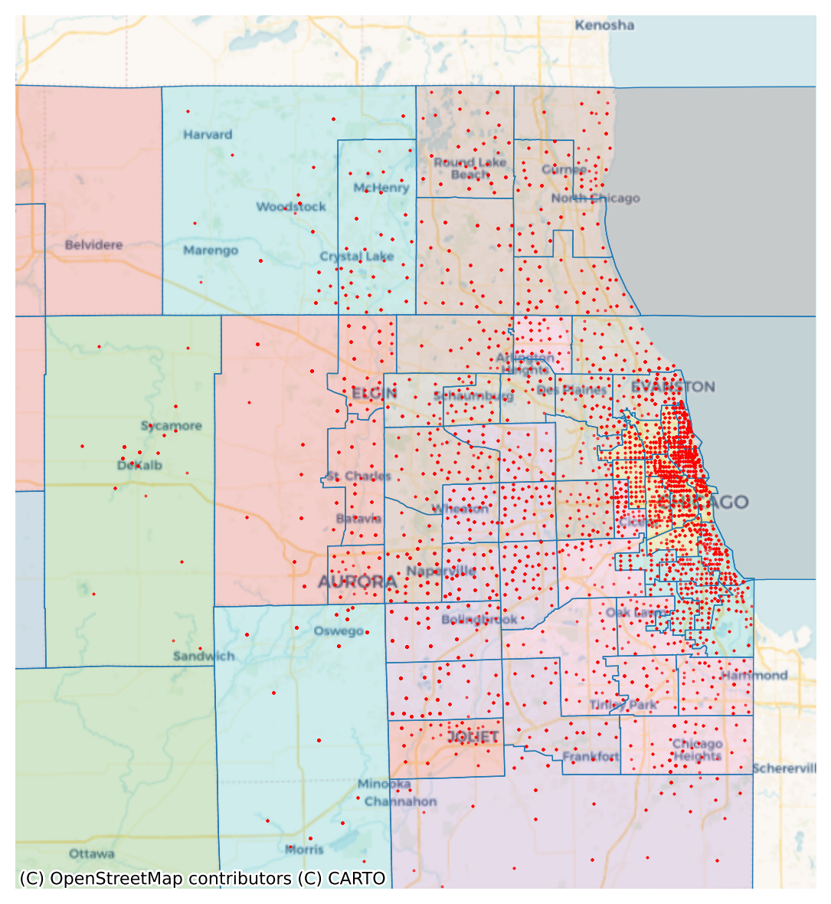

# Data Overview

The data used for this project consists of two primary data sources. (1) The 2019 [My Daily Travel](https://github.com/CMAP-REPOS/mydailytravel) travel survey conducted by the [Chicago Metropolitan Agency for Planning (CMAP)](https://cmap.illinois.gov/) and the (2) 2019 American Community Survey (ACS) 1-Year [Public Use Microdata Sample (PUMS)](https://www.census.gov/programs-surveys/acs/microdata/access.2019.html#list-tab-735824205). The objective of this project is to replicate the results of the My Daily Travel travel survey using a synthetic population derived from the PUMS dataset. The following is an overview of the relevant data sets from both data sources, and the desired transformations on the data used in the project.

## Datasets

### My Daily Travel Survey

Data from this survey was obtained from CMAP's [github repository](https://github.com/CMAP-REPOS/mydailytravel) for the analysis of the 2019 survey. The data can be found at `mydailytravel/source/MyDailyTravelData.zip` and the three relevant files are `data_dictionary.xlsx`, `person.csv`, and `location,csv`.

The person dataset contains socio-demographic data related to an individual and their survey responses about their travel behavior. The data covers 30,683 survey respondents with 116 columns of socio-demographic variables and survey responses. This is the data we are **explicitly trying to replicate** using LLM-enhanced agents, and we will be comparing our replicated survey using metrics that compare the dispersion, central tendency, and distribution shape.

| sampno   | perno | date_completed | retmode_final | retmode | ... | dtype_dk | qc_trip_person | pertrips | wtperfin   |
|----------|-------|----------------|---------------|---------|-----|----------|----------------|----------|------------|
| 20000083 | 1     | 2017-10-12     | 2             | 2       | ... | -1       | 2              | -1       | 155.2391   |
| 20000136 | 1     | 2017-10-24     | 2             | 2       | ... | -1       | 2              | -1       | 319.6422   |
| 20000136 | 2     | 2017-10-24     | 2             | 5       | ... | -1       | 2              | -1       | 319.6422   |
| 20000136 | 3     | 2017-10-24     | -1            | -1      | ... | -1       | 2              | -1       | 319.6422   |
| 20000228 | 1     | 2017-10-02     | 2             | 2       | ... | -1       | 2              | -1       | 540.4961   |

The index columns `sampno` and `perno` identify each individual by household and responsdent per household. The household ID `sampno` is furthermore the top level household identifier connecting the person dataset with the location dataset, and every other dataset in the source repository.

Conversely, the location dataset contains information on the most frequent locations visted per `sampno` household.

| sampno  | locno | perno | loctype | state | country | state_fips | county_fips | tract_fips | out_region | home | latitude  | longitude   |
|---------|-------|-------|---------|-------|---------|------------|-------------|------------|------------|------|-----------|-------------|
| 20000083 | 10000 | -1    | 1       | IL    | USA     | 17         | 31          | 802403     | 0          | 1    | 42.14187  | -87.953126  |
| 20000083 | 10002 | 1     | 2       | IL    | USA     | 17         | 31          | 801601     | 0          | 0    | 42.145289 | -87.863023  |
| 20000083 | 10401 | -1    | 4       | IL    | USA     | 17         | 31          | 801606     | 0          | 0    | 42.116325 | -87.868708  |
| 20000083 | 10402 | -1    | 4       | IL    | USA     | 17         | 31          | 803007     | 0          | 0    | 42.131743 | -87.970674  |

The relevant information derived from this dataset is the latitidue and longitude of a location, and location type, where `loctype == 1` corresponds to a household's actual home location. Note that the `perno` column contains values of -1, this is a common pattern in the My Daily Travel datasets corresponding to an N/A value.

### Public Use Microdata Sample

Th 2019 American Community Survey (ACS) Public Use Microdata Sample (PUMS) files are a set of untabulated records about individual people or housing units. PUMS files are available on the [File Transfer Protocol (FTP)](https://www2.census.gov/programs-surveys/acs/data/pums/) site in both CSV and SAS formats. Both formats contain two record types including housing files (e.g. "csv_hak" or "sas_hak") or person files (e.g. "csv_pak" or "sas_pak"). Of interest to us are the 2019 1-Year person and household datasets, `psam_h17.csv` and `psam_p17.csv` respectively, and the associated data dictionary.

The person dataset contains the socio-demogrpahic information for around 125,000 individuals in the state of Illinois. There are 288 columns consisting of identifier and analysis related information, socio-demographic data, and record-allocation flags. The household dataset contains around 59,000 records of households belonging to individuals in the person dataset.

### Geospatial data

Both person and household PUMS datasets contain a `PUMA` column, relating instances of the datasets to the Public Use Microdata Areas (PUMAs) dataset. Public Use Microdata Areas (PUMAs) are non-overlapping, statistical geographic areas that partition each state or equivalent entity into geographic areas containing no fewer than 100,000 people each. After each decennial census, the Census Bureau delineates Public Use Microdata Areas (PUMAs) for the tabulation and dissemination of decennial census Public Use Microdata Sample (PUMS) data, American Community Survey (ACS) PUMS data, and ACS period estimates. Nesting within states, or equivalent entities, PUMAs cover the entirety of the United States, Puerto Rico, Guam, and the U.S. Virgin Islands. PUMA delineations are subject to population, building block geography, geographic nesting, and contiguity criteria. Each PUMA is identified by a 5-character numeric census code that may contain leading zeros and a descriptive name.

PUMAs for the state of Illinois were sourced from the [US Open Data Catalog](https://catalog.data.gov/dataset/tiger-line-shapefile-2019-series-information-for-the-2010-census-public-use-microdata-area-puma). This geospatial dataset is joined to the My Daily Travel location dataset, which will serve as the basis of sampling the PUMS person dataset proportionally to the My Daily Travel survey respondent sample size.


<div style="text-align: center;">
    
    <figcaption>PUMAs areas and My Daily Travel aggregated household locations</figcaption>
</div>
<br>


The figure above shows the Illinois PUMAs and the aggregated locations of survey resondents households from the My Daily Travel location dataset. PUMAs for the state of Illinois were sourced from the [US Open Data Catalog](https://catalog.data.gov/dataset/tiger-line-shapefile-2019-series-information-for-the-2010-census-public-use-microdata-area-puma). This geospatial dataset is joined to the My Daily Travel location dataset, which will serve as the basis of sampling the PUMS person dataset proportionally to the My Daily Travel survey respondent sample size.

## Data transformations

The PUMS datasets serve as the basis for synthetic population synthesis, which requires a method to convert the tabular csv data to a text representation for LLM input. Using the [PUMS data dictionary](https://www.census.gov/programs-surveys/acs/microdata/documentation.2019.html#list-tab-1370939201), we create a mapping JSON that links dataset variable, and how each variable is coded. An example of some person variables in the person map looks like this:

```json
{
"LANX": {
        "description": "Language other than English spoken at home",
        "answers": {
            "b": "N/A (less than 5 years old)",
            "1": "Yes, speaks another language",
            "2": "No, speaks only English"
        }
    },
    "MAR": {
        "description": "Marital status",
        "answers": {
            "1": "Married",
            "2": "Widowed",
            "3": "Divorced",
            "4": "Separated",
            "5": "Never married or under 15 years old"
        }
    },
    "MARHD": {
        "description": "Divorced in the past 12 months",
        "answers": {
            "b": "N/A (age less than 15 years; never married)",
            "1": "Yes",
            "2": "No",
            "8": "Suppressed for data year 2018 for select PUMAs"
        }
    }
}
```

and the housing map looks like this:

```json
{
    "NP": {
        "description": "Number of persons in this household",
        "answers": {
            "0": "Vacant unit",
            "1": "One person in household or any person in group quarters",
            "20": "Number of persons in household"
        }
    },
    "TYPE": {
        "description": "Type of unit",
        "answers": {
            "1": "Housing unit",
            "2": "Institutional group quarters",
            "3": "Noninstitutional group quarters"
        }
    },
    "ACCESS": {
        "description": "Access to the Internet",
        "answers": {
            "b": "N/A (GQ/vacant)",
            "1": "Yes, by paying a cell phone company or Internet service provider",
            "2": "Yes, without paying a cell phone company or Internet service provider",
            "3": "No access to the Internet at this house, apartment, or mobile home"
        }
    }
}
```

Similarly, the data dictionary for the My Daily Travel survey is used to create a survey question JSON. This JSON is used to query the LLM agents with questions from the survey, and provide the possible responses available for each question.


```json
{
  "SMRTPHN": {
    "question": "Do you have a smartphone?",
    "response": {
      "-8": "I don't know",
      "-7": "I prefer not to answer ",
      "-1": "Appropriate skip",
      "1": "Yes",
      "2": "No"
    }
  },
  "EMPLY_ASK": {
    "question": "Are you employed? (Being employed includes doing any work for pay.)",
    "response": {
      "-8": "I don't know",
      "-7": "I prefer not to answer",
      "-1": "Appropriate skip",
      "1": "Yes",
      "2": "No"
    }
  },
  "JOBS": {
    "question": "How many jobs do you work?",
    "response": {
      "-8": "I don't know",
      "-7": "I prefer not to answer",
      "-1": "Appropriate skip"
    }
}
```

To transfer this project across regions and datasets requires at minimum the generation of the above three JSONs. There are scripts in this project to automate this process, and for the PUMS and CMAP data, about 80% of the process is automated followed by 20% manual adjustments. Further manual adjustments, primarily in the form of removing fields, must be as well.

# Preprocessing

